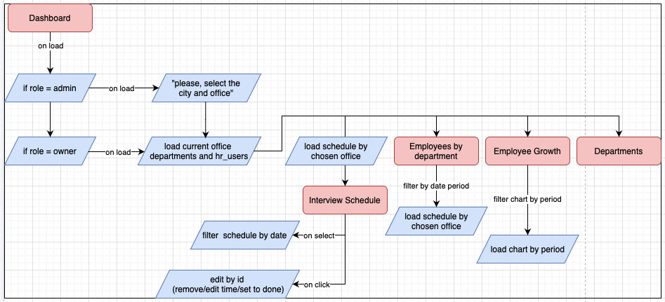

# Dashboard
### Логика работы


- При загрузке страницы проверяется роль пользователя
  - Если роль пользователя - admin
    - Появляется окно "пожалуйста, выберите офис"
      - после выбора загружаются данные [указаные ниже](data)
  - Если роль пользователя owner
    - Определить к какому офису привязан пользователь
      - Загружаются данные, [указанные ниже](data)

# Data
### Возращаемые значения

```json
{
  "departments": [
    {
      "_comment": "возвращается массив данных, используется для подсчета количества сотрудников отдела.",
      "id": "some random id",
      "identity": "backend",
      "name": "Backend department",
      "leadIds": "some random id of user here"
    }
  ],
  "users": [
    {
      "_comment": "Используется для подсчета общего количества пользователей в департамента (искать данное поле нужно у пользователя, id которого указан в department.leadId",
      "id": "some user id",
      "photo": "some base64 photo code",
      "usersUnderControl": 0
    }
  ],
  "chart": [
    {
      "_comment": "отрисовка графика идет по полю totalActive",
      "id": "some random chart id",
      "dateTime": "ISO Date string",
      "totalActive": 1,
      "totalInactive": 2,
      "totalEmployees": 3,
      "totalInterns": 4,
      "totalCandidates": 5,
      "totalUsers": "totalEmployees+totalInterns"
    }
  ],
  "events": [
    {
      "id": "some random event id will be here",
      "startTime": "iso dateTime string in utc zone",
      "endTime": "iso date time string in utc zone",
      "eventName": "Some event name... Like 'Interview' or something else",
      "userId": "user id of task creator will be here"
    }
  ]
}
```

# Algorithms

### Подсчет общего количества пользователей в депортаменте
```typescript
const countInDep = (departments: Array, users: Array) => {
    const totalUsersInDep = [];
    for (let i = 0; i < departments.length; i++) {
        const leadId = departments[i].leadId;
        const usersTotalinDep = 1 + users.find(
            user => user.id === leadId
        ).usersUnderControl.lenght
      totalUsersInDep.push({
        departmentName: departments[i].identity,
        totalUsers: usersTotalinDep;
      })
    }
}
```

###
