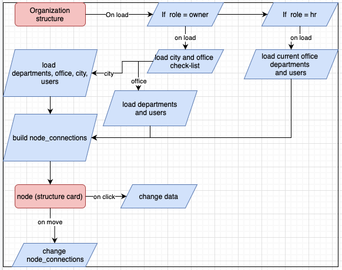

# Страница структуры организации

### Логика рабоы



- При загрузке страницы выполняется проверка на роль пользователя
  - Если роль пользователя admin, то дается возможность выбрать город и/или ооффс
  - Если роль пользователя owner, то загружаются данные офиса, к которому привязан авторизованный юзер. Поиск офиса идет через id департамента
- После загрузки данных идет динамическое построение связей
  - Если выбран только город
    - От Саши и Насти (фиксированные id, нужна будет дополнительная проверка на имя/id) тянется связь к офисам и департаментам, id которых указаны в объекте city (смотри в формате входных данных)
      - От офисов тянется связь к департаментам, id которых указаны в объекте офиса (смотри в формате входных данных)
    - От департаментов идет связь к лидам (leadId объекта департамента)
      - От лида связь тянется к usersUnderControl и mentoredOnUsers
        - От пользователей полученных в массиве usersUnderControl при наличае данных в mentoredOnUsers тянутся дополнительные связи

### Формат входных данных:

```json5
{
  _comment: "Структура данных на странице `Структура организации` при выборе только города",
  users: [
    {
      _comment: "Общая структура данных пользователя на данной странице",
      id: "Идентификационный номер сотрудника",
      email: "Электронная почта сотрудника",
      firstName: "Имя сотрудникa",
      lastName: "Фамилия сотрудника",
      cardColor: "Значение цвета в формате hex-строка",
      isLead: "Булево значение, отображающее, является ли сотрудник лидом департамента",
      usersUnderControle: [
        "Массив идентификационных номеров сотрудников, находящихся под контролем лида. Только при условии что значение isLead = true",
      ],
      mentorOfUsers: [
        "Массив идентификационных номеров сотрудников-стажеров находящихся на обучении любого другого сотрудника",
      ],
      positionID: "К MVP здесь будет протсая строка, в будущем - id позиции",
    },
    {
      _comment: "Структура объекта пользователя, если сотрудник лид департамента",
      id: "92SmGI8Xf9",
      email: "test@mail.com",
      firstName: "UserFirstName",
      lastName: "UserLastName",
      cardColor: "#ef7b27",
      isLead: true,
      usersUnderControle: ["92SmGI8Xf9", "92SmGI8Xf9"],
      mentorOfUsers: ["92SmGI8Xf9", "92SmGI8Xf9"],
      positionID: "Team Lead",
    },
    {
      _comment: "Структура объекта пользователя, если сотрудник не лид департамента.",
      id: "92SmGI8Xf9",
      email: "test@mail.com",
      firstName: "UserFirstName",
      lastName: "UserLastName",
      cardColor: "#ef7b27",
      isLead: false,
      usersUnderControle: null,
      mentorOfUsers: ["92SmGI8Xf9", "92SmGI8Xf9"],
      positionID: "Advanced Developer",
    },
  ],
  _comment: "Общая структура данных департамента на данной странице",
  departments: [
    {
      id: "Идентификационный номер департамента",
      identify: "Краткое название департамента",
      name: "Полное наименование департамента",
      cardColor: "Значение цвета в формате hex-строка",
      leadsId: "Идентификационные номера лидов департамента",
    },
    {
      _comment: "В случае если выбран город, у департамента может быть несколько лидов. Если выбран город и оффис - только 1 лид на департамент",
      id: "92SmGI8Xf9",
      identify: "backend",
      name: "Backend department",
      cardColor: "#ef7b27",
      leadsId: ["92SmGI8Xf9", "92SmGI8Xf9"],
    },
  ],
  _comment: "Объект оффис будет возвращаться только в том случае, если выбран город и не выбран офис",
  office: [
    {
      id: "Идентификационный номер оффиса",
      fullAdress: "Полный адрес офиса",
      departmentId: "Массив с номерами департаментов",
    },
    {
      id: "92SmGI8Xf9",
      fullAdress: "Russia, Rostov-On-Do, Pray st, 76",
      departmentId: ["92SmGI8Xf9", "92SmGI8Xf9"],
    },
  ],
  _comment: "Объект города будет возвращаться только в том случае, когда выбран только город",
  city: {
    id: "Идентификационный номер города",
    shortName: "краткое название города, например РНД",
    departmentId: "Массив с id глобальных департаментов",
    officeId: "Массив с офисами, относящимися к городу",
  }
}
```
