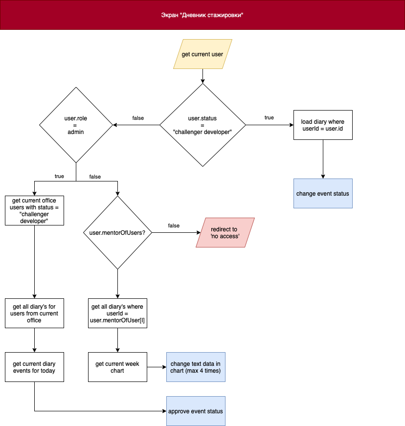

# Страница "Города и оффисы"

Данная страница доступна всем пользователям, однако функционал для ролей "user" отсутствует.

## Логика работы


При загрузке страницы:

- Проверяется роль пользователя
  - Если роль пользователя = "owner" || "admin", то отрабатывает логика, описанная в пункте 2
  - Если роль пользователя != "owner" || "admin", то загружаются данные, указанные ниже, но нет возможности функционально взаимодействовать со страницей
- Загружается список городов и оффисов, в формате:
```json
    {
        "city": {
            "id": "Тут будет идентификатор города",
            "fullName": "Тут будет полное название города",
            "shortName": "Тут будет короткое имя города",
            "officeId": "Тут будет список id офисов, относящихся к городу"
        },
        "city_example": {
            "_comment": "Это пример возвращаемого объекта",
            "id": "123345567zfssd72Sfnk",
            "fullName": "Rostov-on-Don",
            "shortName": "RND",
            "officeId": ["123987qweasd654", "123987qweasd654"]
        },
        "office": {
            "id": "Тут будет идентификатор оффиса",
            "fullAddress": "Тут будет полный адресс офиса",
            "phone": "Тут будет номер телефона для связи с офисом",
            "coordinates": "Вариант для дизайнера, возможно предусмотреть вставку карты для каждого оффиса"
        },
        "office_example": {
            "_comment": "Это пример возвращаемого объекта",
            "id": "123345567zfssd72Sfnk",
            "fullAddress": "Russia, Rostov region, Rostov-on-Don, Lenina str., 94",
            "phone": "+7-(999)-999-99-99",
            "coordinates": "47.249250, 39.734560"
        } 
    }
```

## Функциоальность страницы
### Данная функциональность доступна только для пользователей с ролью "owner" || "admin"

- Добавление нового города
- Добавление нового офиса внутри города
- Удаление офиса
  - Подразумевает под собой увольнение либо перераспределение относящихся к нему сотрудников
- Удаление города
  - Подразумевает под собой удаление всех относящихся к городу офисов